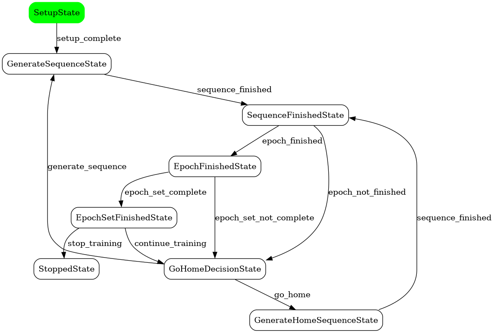

How to use this Framework
=========================

`python-goal-babbling` can be used to train any machine learning model as an inverse estimate in an online fashion. In
order to get started, you need to:

1. Generate a set of training and test goals. These are sets of **observations** which are located in the workspace of your forward model
2. Implement a forward model class which implements :py:class:`pygb.interfaces.AbstractForwardModel`
3. Implement an inverse estimate class which implements :py:class:`pygb.interfaces.AbstractInverseEstimate`
4. (Optional) If you wish to store the best performing estimate you should implement a cache which implements :py:class:`pygb.interfaces.AbstractEstimateCache`. If you intend to train multiple epoch sets and load the previous best model, this is a must.

Vanilla Goal Babbling
---------------------

`python-goal-babbling` is implemented as a state machine. Use :py:func:`pygb.vanilla_goal_babbling` to create a
pre-configured state machine which implements Goal Babbling for inverse kinematics learning as intended by Rolf et al.
(2010).

Creating and running the state machine is as easy as::

    state_machine = vanilla_goal_babbling(...)
    state_machine.run()

Besides the forward model, an inverse estimate wrapper, and the optional estimate cache,
:py:func:`pygb.vanilla_goal_babbling` requires the following:

**parameters (Goal Babbling Parameters)**

Either a single :py:class:`pygb.GBParameters` instance or a list containing multiple. Specifies Goal Babbling parameters
such as *sigma*, *sequence length*, *epoch length* or the *return-home probability*. If you specify multiple parameter
sets, you automatically set the amount of epoch sets.

Specifying a full parameter set for each epoch set is lengthy - use :py:class:`pygb.GBParameterIncrement` instances to
only update those parameters that change while copying the remaining from the previous parameter set::

    from pygb import GBParameters, GBParameterIncrement
    import numpy as np

    # specify three epoch sets:
    parameters = [
        GBParameters(
            sigma=0.002,
            sigma_delta=0.1,
            dim_act=6,
            dim_obs=3,
            len_sequence=10,
            len_epoch=10,
            len_epoch_set=2,
            go_home_chance=0.1,
            home_action=np.array([...]),
            home_observation=np.array([...]),
        ),
        GBParameterIncrement(
            go_home_chance=0.2
        ),
        GBParameterIncrement(
            len_sequence=42
        )
    ]

**goal_sets (Training and Test Goal Sets)**

Either a single :py:class:`pygb.GoalSet` instance or a list of multiple instances. Each goal set is composed of `train`
goals and `test` goals - the former are used for training, i.e. sequences are generated between them while the inverse
estimate is trained. The latter is used to calculate the estimate's performance at the end of each epoch.

You may also define optional additional goal test sets (e.g. if you want to track the estimate's performance in two
different workspaces::

    from pygb import GoalSet

    goal_set = GoalSet(
        train=np.array([[...]]),
        test=np.array([[...]]),
        optional_test: {
            "workspace1": np.array([[...]]),
            "workspace2": np.array([[...]])
        }
    )

The performances on all test sets are calculated (as the **RMSE in m**) after each epoch. They are stored in the
:py:class:`pygb.GoalBabblingContext` in its :py:class:`pygb.RuntimeData` member.

**goal_selector (Global Goal Selection Method)**

Goal Babbling trains an inverse estimate by generating sequences of observations in the robot's workspace. Thus, some
sort of selection scheme is necessary to select the target of the next sequence. Choose one of 

* :py:class:`pygb.RandomGoalSelector`
* :py:class:`pygb.ErrorBasedGoalSelector`
* :py:class:`pygb.IntrinsicMotivationGoalSelector`

The latter is the most sophisticated one and produces the fastest workspace exploration. Feel free to implement your own
selection scheme by implementing :py:class:`pygb.interfaces.AbstractGoalSelector`.

What happens under the hood
---------------------------

Using :py:func:`pygb.vanilla_goal_babbling` hides the creation of a state machine. Internally, it creates a series
of states from the :py:mod:`pygb.states` sub-package, all implementing :py:class:`pygb.interfaces.AbstractState`.
It adds these states to the state machine's transition table as the targets of string `transitions`. Whenever a state
is executed by the state machine it returns a `transition`. This way, the state can decide where to go next after its
completion.

Setting up the state machine manually works as follows::

    from pygb import StateMachine, GoalBabblingContext
    from pygb.interfaces import AbstractState
    from pygb.states import SetupState, StoppedState

    class MyState(AbstractState):
        ...

    context = GoalBabblingContext(...)
    state_machine = StateMachine(context, initial_state=SetupState(context))

    state_machine.add("setup_complete", MyState(context))
    state_machine.add("my-state-transition", StoppendState(context))

You can visualize the created state machine using `pydot`::

    state_machine.graph("target_directory")

This requires the `pydot` dependency to be installed. The default state machine looks as follows:

When to stop training
---------------------

Goal Babbling is an online learning method, so theoretically there is no real end of training. Usually, you would like
to use the trained estimate at some point, though. Use one of :py:class:`pygb.interfaces.AbstractStoppingCriteria`'s
implementations to define criteria when to stop training:

* :py:class:`pygb.TargetPerformanceStop`
* :py:class:`pygb.TimeBudgetStop`
* :py:class:`pygb.PerformanceSlopeStop`

These can be passed as an optional parameter to the :py:class:`pygb.GBParameters` constructor. It is possible to specify
different stopping criteria per epoch set.

Goal Babbling Context
---------------------

An instance of :py:class:`pygb.GoalBabblingContext` (which implements
:py:class:`pygb.interfaces.AbstractContext`) is used as a central data container. It contains (among others)

* the forward model
* the inverse estimate
* the Goal Babbling parameters for each epoch set
* goal sets for each epoch set

Additionally, it provides information on the current training state in form of a :py:class:`pygb.RuntimeData` instance.
The state machine and all states access the context, i.e. read and write data to and from it.

Getting notified about context changes
--------------------------------------

You can define callbacks which access the Goal Babbling context at the end of a sequence, at the end of an epoch, or at
the end of an epoch set. Simply define a function which has a single parameter, the `context`, and decorate it with the
:py:func:`pygb.observes` decorator::

    from pygb import Events, observes

    @observes(Events.SEQUENCE_FINISHED)
    def sequence_finished_callback(context):
        print(context.runtime_data.performance_error)

    @observes(Events.EPOCH_COMPLETE)
    def epoch_finished_callback(context):
        print(context.runtime_data.performance_error)

    @observes(Events.EPOCH_SET_COMPLETE)
    def epoch_set_finished_finished_callback(context):
        print(context.runtime_data.performance_error)

Alternatively, register callbacks manually (this allows to register class members as well)::

    class MyCustomLogger:

        def log(self, context):
            print(context.runtime_data.performance_error)

    from pygb import EventSystem

    event_system = EventSystem.instance() # get global singleton instance
    event_system.register_observer(Events.EPOCH_COMPLETE, MyCustomLogger().log)

Other Goal Babbling components
------------------------------

Other important Goal Babbling components are implemented in 

* :py:class:`pygb.LinearPathGenerator`
* :py:class:`pygb.GBWeightGenerator`
* :py:class:`pygb.GBHomeWeightGenerator`
* :py:class:`pygb.GBNoiseGenerator`

Check their documentation and the publications on Goal Babbling to get more detailed information.